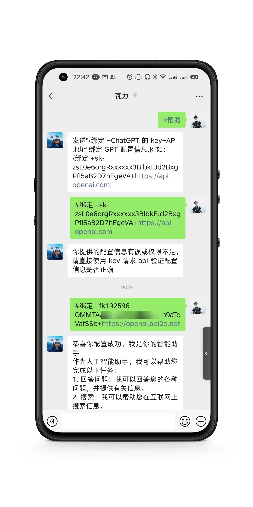

# WechatGPT

## 启动项目

1.安装依赖及启动

```
npm i
npm start
```

2.扫描二维码登录微信

3.使用任意微信（可以是当前登录机器人的微信向自己发送消息）发送 #帮助

4.发送如下格式给机器人，完成ChatGPT配置

```
#绑定+sk-zsL0e6orgRxxxxxx3BlbkFJd2BxgPfl5aB2D7hFgeVA+https://api.openai.com 
```

## 效果展示




