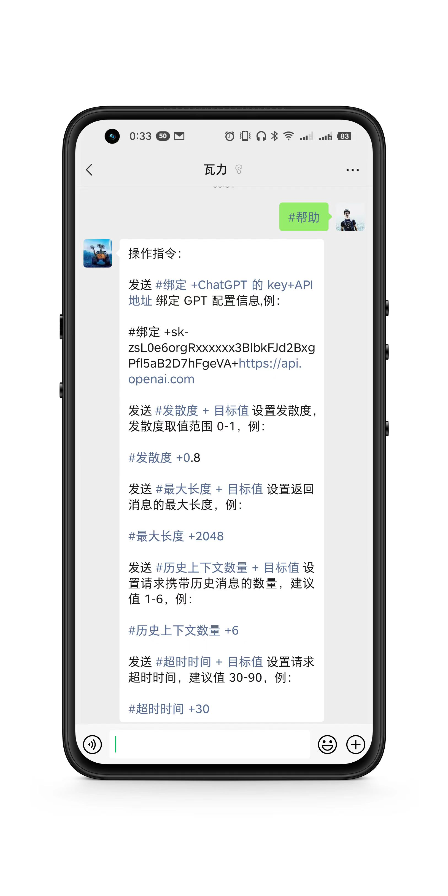
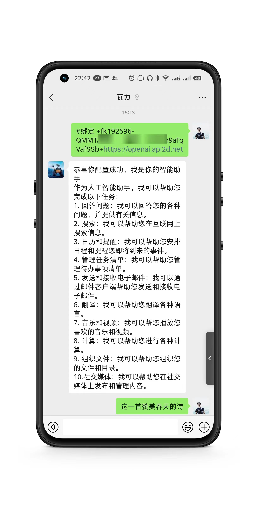
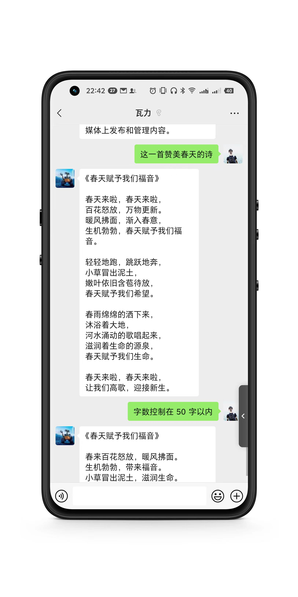
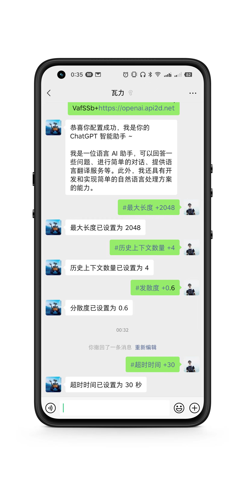

# WechatGPT

WechatGPT是一个使用微信充当ChatGPT对话窗口的工具,目前已实现的功能：

- #指令 唤起操作指南
- 支持通过关键字指令设置key及接口调用参数，目前已支持openai、api2d接入
- 支持使用语音与gpt对话
- 支持设置系统提醒词

## 启动项目

1.安装依赖及启动

```
npm i
npm start
```

2.扫描二维码登录微信

3.使用任意微信发送 #帮助 可获取操作指令

4.发送如下格式给机器人，完成ChatGPT配置

```
#绑定+sk-zsL0e6orgRxxxxxx3BlbkFJd2BxgPfl5aB2D7hFgeVA+https://api.openai.com 
```

> 已支持api2d，不用梯子可以使用的openai接口 https://api2d.com

修改配置文件可更换puppet及配置百度云语音转文字接口ak、sk

```
const baseConfig = {
  admin:{
    wxid: process.env['admin_wxid'] || '', //管理员微信ID
    roomid: process.env['admin_roomid'] || '', //管理群ID
  },
  openai:{
    key: process.env['openai_key'] || '', //openai api密钥
    endpoint: process.env['openai_endpoint'] || 'https://api.openai-proxy.com', //openai api地址
  },
  baiduvop: {
    ak: process.env['baiduvop_ak'] || '', // 百度云语音转文字接口ak
    sk: process.env['baiduvop_sk'] || '', // 百度云语音转文字接口sk
  },
  wechaty: {
    puppet: process.env['wechaty_puppet'] || 'wechaty-puppet-wechat4u', //wechaty-puppet-padlocal、wechaty-puppet-service、wechaty-puppet-wechat、wechaty-puppet-wechat4u、wechaty-puppet-xp（运行npm run wechaty-puppet-xp安装）
    token: process.env['wechaty_token'] || '', // wechaty token
  },
}
```

## 安装及启用语音转文字插件

详细步骤参考 https://github.com/Ang-YC/wx-voice

> 成功安装插件后可在index.ts中解除注释，使用语音与gpt聊天问答

1. 安装依赖

```
npm install wx-voice --save
npm install wx-voice -g
wx-voice compile
```

2. 安装ffmpeg（Windows操作系统安装方式及环境变量设置自行百度）

Ubuntu

```
sudo add-apt-repository ppa:mc3man/trusty-media  
sudo apt-get update  
sudo apt-get install ffmpeg
```

CentOS

```
sudo yum install epel-release
sudo yum update
sudo rpm --import http://li.nux.ro/download/nux/RPM-GPG-KEY-nux.ro
```

For CentOS 7:

```
sudo rpm -Uvh http://li.nux.ro/download/nux/dextop/el7/x86_64/nux-dextop-release-0-5.el7.nux.noarch.rpm
```

For CentOS 6:

```
sudo rpm -Uvh http://li.nux.ro/download/nux/dextop/el6/x86_64/nux-dextop-release-0-2.el6.nux.noarch.rpm
```

Install FFMPEG:

```
sudo yum install ffmpeg
```

Mac

```
brew install ffmpeg
```

## Docker部署

```
docker run -d 
--restart=always 
--env wechaty_puppet="wechaty-puppet-wechat4u" 
--env wechaty_token="wehcaty token" 
--env baiduvop_ak="百度语音转文字服务ak"
--env baiduvop_ak="百度语音转文字服务sk"
--env admin_wxid="管理员微信ID"
--env openai_key="你的openai api key"
atorber/wechatgpt:v0.8.1
```

## 机器人协议支持

可参考 [wechat-openai-qa-bot](https://github.com/choogoo/wechat-openai-qa-bot) 项目关于wechaty机器人协议的支持，自行切换至其他协议 https://www.yuque.com/atorber/oegota/hgmhxclivlwn090z

## 效果展示

- 指令说明



- 绑定ChatGPT



- 对话聊天



- 设定参数



## 关于封号

偶尔有收到反馈封号提示问题，可优先使用wechaty-puppet-xp、wechaty-puppet-padlocal、wechaty-puppet-padlocal

一般来说机器人的发送行为尽可能接近人类，几乎可以避免封号，可导致封号的行为供参考（不完全统计，自行评估风险）：

- 频繁切换程序登录IP，即频繁切换机器登录

- 高频发送消息

- 高频秒回消息

- 发送敏感、非法信息

特别提示，建议使用小号进行测试，以免因各种原因的导致主号被封给自己的生活带来不便

## Star History

[](https://star-history.com/#choogoo/wechatgpt&Date)

## 更新日志

v0.8.0

- 增加指令开通助手功能，管理员在群内发送 #开通 开启助手，发送 #关闭 关闭助手

v0.7.0

- 新增语音聊天，支持使用语音与GPT对话，使用百度云语音转文字接口（index.ts文件中注释部分）
- 优化配置文件

v0.6.0

- 新增 #系统提示词+现在开始你是相声演员郭德纲，你将以郭德纲的身份回答我的问题 系统提示词设置功能
- 新增 #清理历史消息 清楚全部历史消息，重新开始对话

v0.5.0

- 新增 #导出文件 功能，发送指令可导出最近消息为word文件

## 工具

安装语音转化 https://github.com/Ang-YC/wx-voice

mac安装 brew install ffmpeg https://blog.csdn.net/weixin_42238038/article/details/122283307
