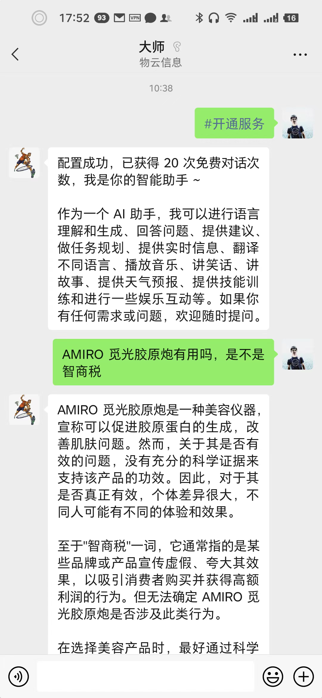
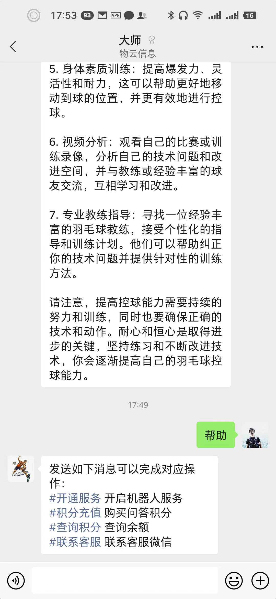

# WechatGPT

WechatGPT是一个使用微信充当ChatGPT对话窗口的工具,目前已实现的功能：

- 支持用户 #开通服务
- 支持为指定用户充值
- 支持使用语音与gpt对话
- 支持设置系统提醒词 %医生 轻度感冒需要如何治疗

## 启动项目

> 首先重命名根目录下.env.example为.env

1.安装依赖及启动

```
npm i
npm start
```

2.扫描二维码登录微信

3.使用任意微信发送 #帮助 可获取操作指令

4.发送如下格式给机器人，完成ChatGPT配置

```
#绑定+sk-zsL0e6orgRxxxxxx3BlbkFJd2BxgPfl5aB2D7hFgeVA+https://api.openai.com 
```

> 已支持api2d，不用梯子可以使用的openai接口 https://api2d.com

修改配置文件可更换puppet及配置百度云语音转文字接口ak、sk

```
HTTP_PORT=9503
WS_PORT=9504
OPENAI_API_KEY=ADD_YOUR_VALUE
OPENAI_API_BASE_URL=https://api.openai-proxy.com
OPENAI_MODEL=gpt-3.5-turbo
OPENAI_ENDPOINT=https://api.openai-proxy.com/v1/chat/completions
ADMIN_ROOM_TOPIC=ADD_YOUR_VALUE
ADMIN_ROOM_ID=ADD_YOUR_VALUE
ADMIN_WX_NAME=ADD_YOUR_VALUE
ADMIN_WX_ID=ADD_YOUR_VALUE
WECHATY_PUPPET=wechaty-puppet-wechat4u
WECHATY_TOKEN=ADD_YOUR_VALUE
```

## Docker部署

```
atorber/wechatgpt:v0.14.1
```

## 机器人协议支持

可参考 [wechat-openai-qa-bot](https://github.com/choogoo/wechat-openai-qa-bot) 项目关于wechaty机器人协议的支持，自行切换至其他协议 https://www.yuque.com/atorber/oegota/hgmhxclivlwn090z

## 效果展示

扫码添加好友体验


### 基本操作

- 开通服务



- 开通服务



### 高级操作

- 指令说明


- 绑定ChatGPT


- 对话聊天


- 设定参数


## 关于封号

偶尔有收到反馈封号提示问题，可优先使用wechaty-puppet-xp、wechaty-puppet-padlocal、wechaty-puppet-padlocal

一般来说机器人的发送行为尽可能接近人类，几乎可以避免封号，可导致封号的行为供参考（不完全统计，自行评估风险）：

- 频繁切换程序登录IP，即频繁切换机器登录

- 高频发送消息

- 高频秒回消息

- 发送敏感、非法信息

特别提示，建议使用小号进行测试，以免因各种原因的导致主号被封给自己的生活带来不便

## Star History

[](https://star-history.com/#choogoo/wechatgpt&Date)

## 更新日志

v0.11.0

- 没有新增功能，优化为使用.env配置全局环境变量

v0.8.1

- 通过在群或好友私聊中发送 #开通 开通chatgpt聊天
- #充值+1000 充值对话次数
- 以及更多的指令操作功能

v0.8.0

- 增加指令开通助手功能，管理员在群内发送 #开通 开启助手，发送 #关闭 关闭助手

v0.7.0

- 新增语音聊天，支持使用语音与GPT对话，使用百度云语音转文字接口（index.ts文件中注释部分）
- 优化配置文件

v0.6.0

- 新增 #系统提示词+现在开始你是相声演员郭德纲，你将以郭德纲的身份回答我的问题 系统提示词设置功能
- 新增 #清理历史消息 清楚全部历史消息，重新开始对话

v0.5.0

- 新增 #导出文件 功能，发送指令可导出最近消息为word文件
